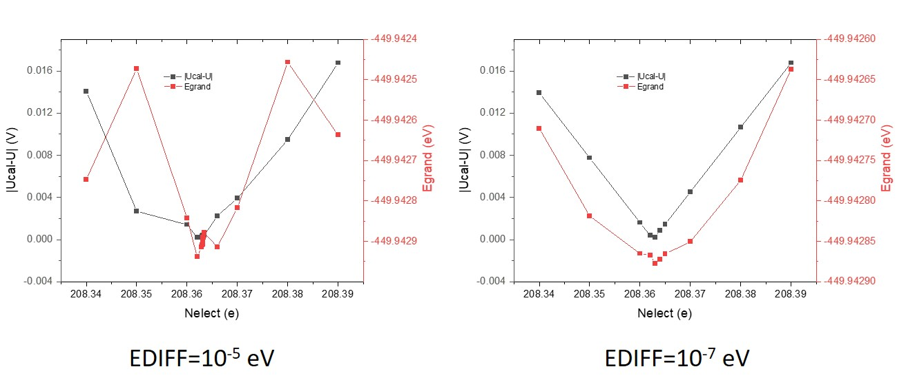

# FCP-abacus-ase
ASE interface for fully converged constant potential (FCP) simulations with [Atomic-orbital Based Ab-initio Computation at UStc (ABACUS)](https://github.com/deepmodeling/abacus-develop)

> FCP-abacus-ase only supports version 2.

The algorithm and constant-potential calculator for vasp was developed by Zhaoming Xia.

**If you use this code, please cite:** ***https://doi.org/10.1021/acs.jctc.3c00237 *** 
The original paper used the code of version 1.0

## Before you use

1. Install [ABACUS](https://github.com/deepmodeling/abacus-develop) first.

2. Make sure you have installed `python` and `pip`.

3. Install [ase-abacus](https://gitlab.com/1041176461/ase-abacus) according to its doc.

2. Copy FCPelectrochem.py (version 2) to "ase_installation_path/calculators/".
    > ase_installation_path can be found by running `ase info`

3. If you want to use PLUMED interface, the python wrap of PLUMED should be installed. Read this page for more information (https://wiki.fysik.dtu.dk/ase/ase/calculators/plumed.html).
4. For ASE >=3.23.0, One should create a 'config.ini' file in '~/.config/ase/' with the follow content:
   [FCP]
   command=
   

## How to use (version 2)

### Example 

    from ase.calculators.FCPelectrochem import FCP
    from ase.calculators.abacus import Abacus, AbacusProfile
    from ase.io import read
    from ase.optimize import LBFGS

    # abacus parameters
    pseudo_dir = r'/home/liuyu/data/ABACUS/PP_ORB'
    basis_dir = r'/home/liuyu/data/ABACUS/PP_ORB'
    pp = {
        'C':'C_ONCV_PBE-1.0.upf',
        'N':'N_ONCV_PBE-1.0.upf',
        'Fe':'Fe_ONCV_PBE-1.0.upf',
        'O':'O_ONCV_PBE-1.0.upf'
    }
    basis = {
        'C':'C_gga_8au_60Ry_2s2p1d.orb',
        'N':'N_gga_8au_60Ry_2s2p1d.orb',
        'Fe':'Fe_gga_9au_60Ry_4s2p2d1f.orb',
        'O':'O_gga_7au_60Ry_2s2p1d.orb'
    }

    kpts = {'size': [3, 3, 1], 'gamma': True}

    parameters = {
        'xc': 'pbe',
        'ecutwfc': 60,
        'nspin': 2,
        'smearing_method': 'gaussian',
        'smearing_sigma': 0.01,
        'basis_type': 'lcao',
        'ks_solver': 'genelpa',
        'mixing_type': 'pulay',
        'scf_thr': 1e-5,
        'scf_nmax': 500,
        'calculation': 'scf',
        'cal_force' : 1,
        'cal_stress' : 1
    }

    profile = AbacusProfile(command='mpirun -n 24 abacus')
    cal_abacus = Abacus(profile=profile, pp=pp, pseudo_dir=pseudo_dir, basis=basis, basis_dir=basis_dir, kpts=kpts, **parameters)

    # FCP parameters
    cal_FCP=FCP(innercalc = cal_abacus,                     # DFT calculator
                fcptxt = 'log-fcp.txt',                     # log file
                U = 0.8,                                    # electrochemical potential vs. SHE
                NELECT = 216.5,                             # initial guess of number of electrons
                C = 1/80,                                   # 1/k  capacitance per A^2
                FCPmethod = 'Newton-fitting',               
                FCPconv = 0.01,
                NELECT0 = 218,                              # number of electrons at the potential of zero charge
                adaptive_lr = False,
                work_ref = 4.6,                             # the work function of SHE in eV. 
                max_FCP_iter = 10000
                )

    atoms=read(filename='STRU', format='abacus')
    atoms.calc = cal_FCP
    dyn=LBFGS(atoms, trajectory='fp.traj')
    dyn.run(fmax=0.01)

### Parameters

    innercalc:
        Type: calculator
        Description: DFT calculator to calculate energy and forces.
        Default: Vasp

    U:
        Type: float
        Description: The potential of working electrode (V vs. reference electrode).
        Default: None
            
    NELECT: 
        Type: float
        Description: initial guess of number of electrons.
        Default: None
            
    NELECT0:
        Type: float
        Description: number of electrons of the potential of zero charge (PZC). 
        Default: None

    FCPmethod: 
        Type: str
        Description: method to run constant-potential calculation.
        Default: 'Newton-fitting'

    FCPconv:
        Type: float
        Description: convergence of \Delta \mu (eV) for constant-potential calculation. 
        Default: 0.01

    work_ref: 
        Type: float
        Description: the work function (the negative value of absolut electrode potential) of reference electrode.
            If the reference electrode is SHE, work_ref is set to the default value. (4.6)
            If the reference electrode is RHE, you should set the work_ref manually according the pH.
        Default: 4.6
       
    C:
        Type: float
        Description: initial guess of capacitance per surface area. (e/V/(Å^2))
        Default: 1/80

    max_FCP_iter: 
        Type: int
        Description: maximum steps for FCP steps.
        Default: 1000

    adaptive_lr: 
        Type: bool
        Description: whether to use adaptive_lr to reduce oscillation
        Default: False

    always_adjust: 
        Type: bool
        Description: Adjust Nelect again even when potential is within tolerance. This is useful to set to True along with a loose potential tolerance (FPconv) to allow the potential and structure to be simultaneously optimized in a geometry optimization.
        Default: True

> The implicit solvent model will shield the dipole on the surface. Any additional dipole correction will lead to unphisical dipole, and the  code will not converge to energy minimum with dipole correction.

## For advanced users

The grand energy Egrand is defined as:

Egrand = E + E_Fermi_shift * (Nelect - Nelect0) + (U + work_SHE) * (Nelect - Nelect0)

Note that the averaged electrostatic potential of the periodic cell is zero for DFT, which indicates that the electronic energy is referenced at the averaged electrostatic potential. It has no influence for the system with no net charge (Nelect - Nelect0 = 0). However, the electronic energy should be referenced at vacuum if the net charge in nonzero, since the work function of SHE is referenced at vacuum. Thus, "E_Fermi_shift * (Nelect - Nelect0)" should not be ignored.

If you want to use this code for other DFT-calculators, you must define a function to calculate the E_Fermi_shift. A reasonable approximation for E_Fermi_shift is to calculate the electrostatic potential at the point where there is the lowest electron density.

The way to verify the E_Fermi_shift is to plot the Egrand and |Ucal-U|. If E_Fermi_shift is reasonable, the minimum point for Egrand and |Ucal-U| should be the same.

The accuracy of electronic steps is critical for the convergence of FCP. I recommend to use a high accuracy for DFT calculations unless the electronic step is extremely slow.

For molecular dynamics, one should turn off "always_adjust" and set max_FCP_iter into 1 to disable the converging of electrochemical potential and allow the fluctuation of electrochemical potential.

